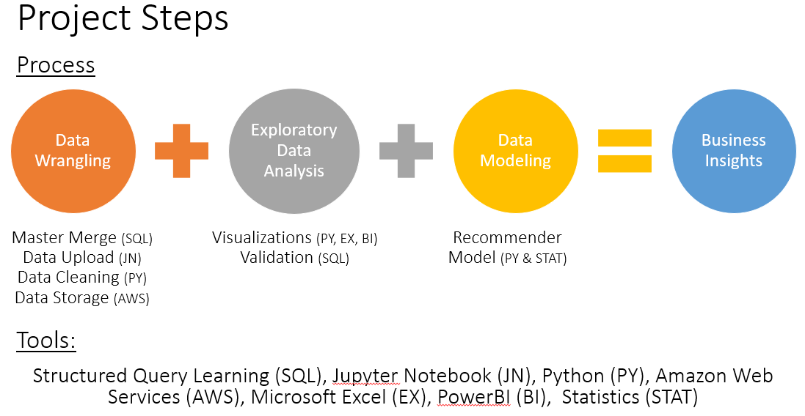

# Instacart: Market Basket Analysis

## Introduction

This project serves as the final capstone for the Fall 2019 Data Analyst Training Accelerator (DATA) cohort from Galvanize in partnership with NYC Tech Talent Pipeline. This assignment required finding an interesting dataset, uncovring a problem / business question to address, and provide solutions through data analysis to be completed within five weeks.

## Data Source

“The Instacart Online Grocery Shopping Dataset 2017”, Accessed from https://www.instacart.com/datasets/grocery-shopping-2017 on 12/16/2019

## Background

https://www.instacart.com

While Instacart may seem like an online grocery store, operationally it is a delivery company hiring local shoppers to deliver groceries (including alcohol) from retail partners. The online grocery landscape is characterized by increasing competition, including some backed by large companies linked to Instacart (such as AmazonFresh + Whole Foods, the most well-known Instacart partner until 2018). In the last few years, Instacart has spent resources on building a competitive advantage expanding alcohol delivery, increasing user engagegement, and launching outside the United States.  As of 2019, Instacart delivers alcohol in 14 states plus Washington DC. This project takes a deeper look at the performance of the alcohol segment up to 2017, when data was collected, and its relation to the grocery core business.

## Project Scope

Question: Does (purchase history) data support continuing alcohol expansion? 
* YES: Continue alcohol expansion. What marketing insights can we collect from data?
* NO: Pivot

 

## Conclusion

Answer: YES, Instacart should continue expanding alcohol service after data analysis on six areas showed positive results.
* High Demand
* Cross-Selling Potential
* Up-Selling Potential
* Position in Cart
* Reordered Rate
* Order Gap

Additional marketing insights discovered include:
* Marketing Timing
* Best Sellers
* Alcohol + Grocery Product Pairings

*Refer to "Presentation" file uploaded for more information on insights and visualizations*

## Technologies Used

* SQL (PostgreSQL)
* Python (NumPy, Pandas, MatPlotLib, Seaborn)
* Jupyter Notebook
* Amazon Web Services (AWS)
* Microsoft Excel
* PowerBI

## Contact Info

Rachelle Perez
rachelleaperez@gmail.com
https://www.linkedin.com/in/rachelleperez/

